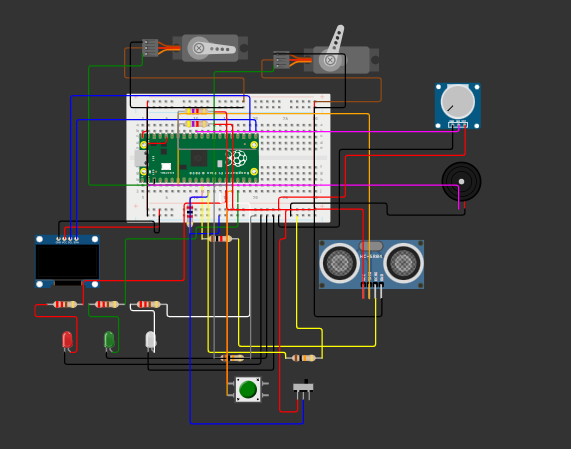

***

# Traitor Air Defence System 
Its a fully automatic desktop air defence turret powered by a Raspberry Pi Pico. 

Basically, this system spins a sensor around to look for enemys. If it sees something closer then the limit, it double checks to make sure its not a glitch. If the target is real, it sounds a loud alarm and uses a second servo to pull the trigger and launch a dart. You can also turn off the firing and just use it as a alarm.

## How it Works 
The code is written in MicroPython and uses a state machine. It has different moods:
* **IDLE:** System is armed but sleeping.
* **SCANNING:** The scan servo sweeps back and forth. The ultrasonic sensor send pulses to check distance.
* **CONFIRM:** If it spots something, it stops and checks 3 times to make sure the target is actually their.
* **ALERT:** FREAK OUT MODE! Red light turns on, buzzer screams and if your in LAUNCH mode, the trigger servo fires.
* **COOLDOWN:** Takes a 5 second break so it does not just keep shooting forever, then goes back to scanning.

## Hardware Components 
Here is the list of things you need to build this:
* **Raspberry Pi Pico** (Main brain)
* **2x Micro Servos** (One for looking around, one for the trigger)
* **1x HC-SR04 Ultrasonic Sensor** (The main sensor that acts as eyes of the system)
* **1x SSD1306 OLED Display (I2C)** (Shows real time state and sensor's data)
* **1x 5V Magnetic Buzzer** (For the alarm)
* **1x NPN Transistor (like 2N2222)** (Very important! Used as a switch so the buzzer does not burn out the Pico pin)
* **1x Potentiometer** (Twisty knob to change how far the sensor looks)
* **1x Push Button** (Main power switch)
* **1x Slide Switch** (To change between ALARM ONLY and LAUNCH mode)
* **3x LEDs** (Red for danger, Green for scanning, White for power)
* **Resistors:** 
  * 3x 220 Ohm (for LEDs)
  * 2x 10k Ohm (Pull-down for switches)
  * 2x 4.7k Ohm (Pull-up for OLED I2C)
  * 1x 1k Ohm & 1x 2k Ohm (Voltage divider to step down the 5V Echo pin to 3.3V so Pico does not break)

## Pin Mapping 
Make sure you wire everything exact like this or the code does not works. 

| Component | Pico Pin | Notes |
| :--- | :--- | :--- |
| **Scan Servo** | `GP3` | PWM out (50Hz) |
| **Trigger Servo** | `GP4` | PWM out (50Hz) |
| **Ultrasonic TRIG** | `GP5` | Sends the sound pulse |
| **Ultrasonic ECHO**| `GP8` | Hears the bounce (Voltage divider is amust here) |
| **Buzzer** | `GP1` | Connect to transistor base with 1k resistor |
| **Mode Switch** | `GP9` | Changes fire mode (needs 10k pull-down) |
| **Power Button** | `GP12` | Main on/off toggle |
| **Power LED (White)**| `GP10` | Shows if system is active |
| **Alert LED (Red)** | `GP11` | Turns on when target locked |
| **Scan LED (Green)** | `GP13` | Blinks when looking around |
| **OLED SCL** | `GP16` | I2C Clock (needs 4.7k pull-up to 3.3v) |
| **OLED SDA** | `GP17` | I2C Data (needs 4.7k pull-up to 3.3v) |
| **Potentiometer** | `GP26` | ADC to read the twisty knob |

## Setup Instructions 
1. Wire all the components on your breadboard using the pin mapping above. 
2. Make sure you put the 100uF capacitor across the 5V power rails so the servos dont crash the Pico when they move
3. Connect the Pico to your computer.
4. Open Thonny IDE.
5. Go to `Tools > Manage Packages` and install `micropython-ssd1306` so the screen works.
6. Copy the python code into a file called `main.py` on the Pico.
7. Unplug from computer, plug into battery bank, and press the power button to start defending your desk